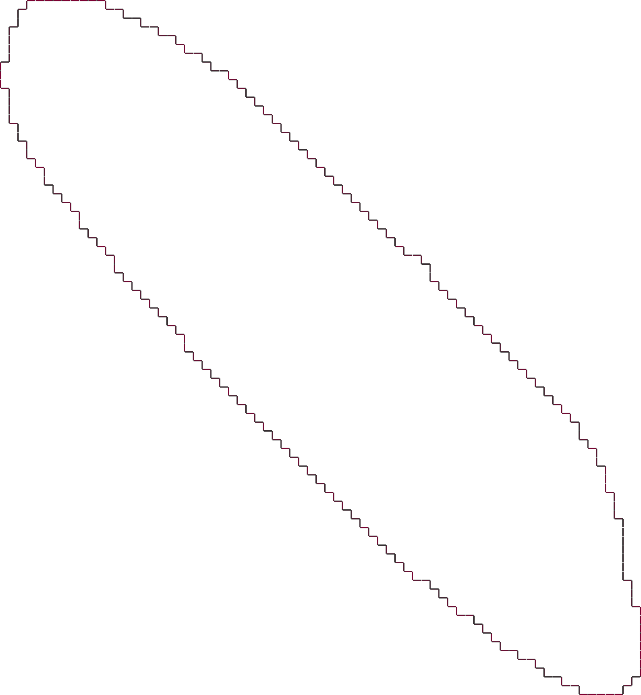
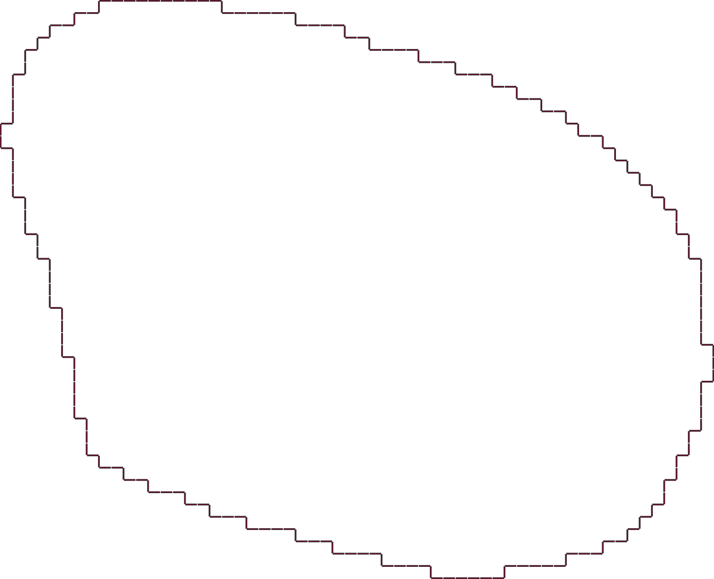
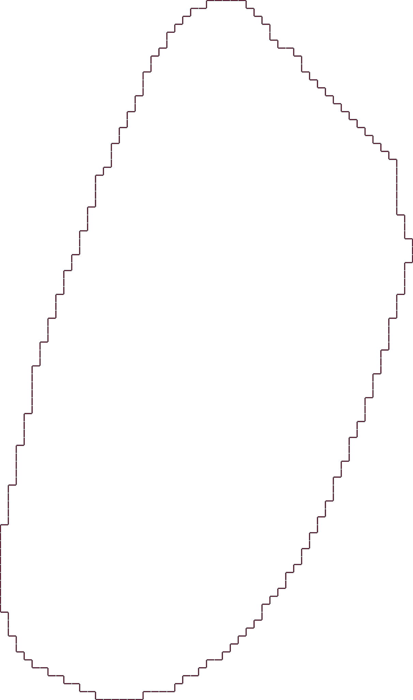
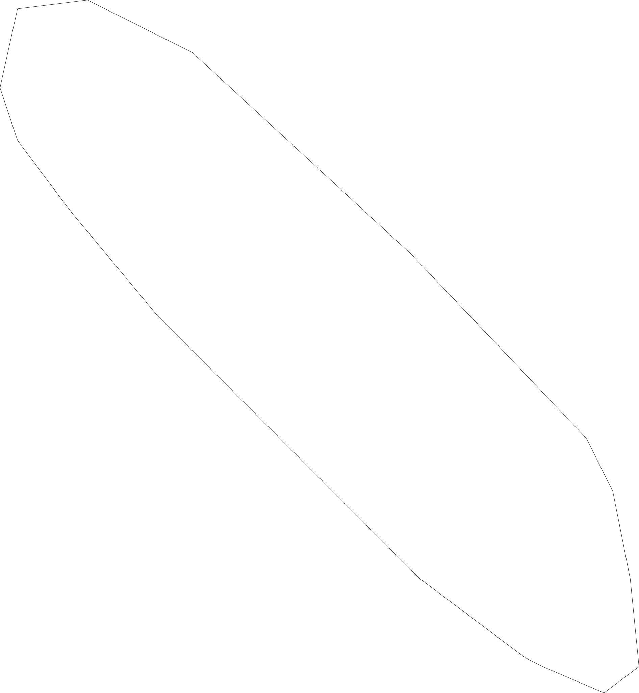
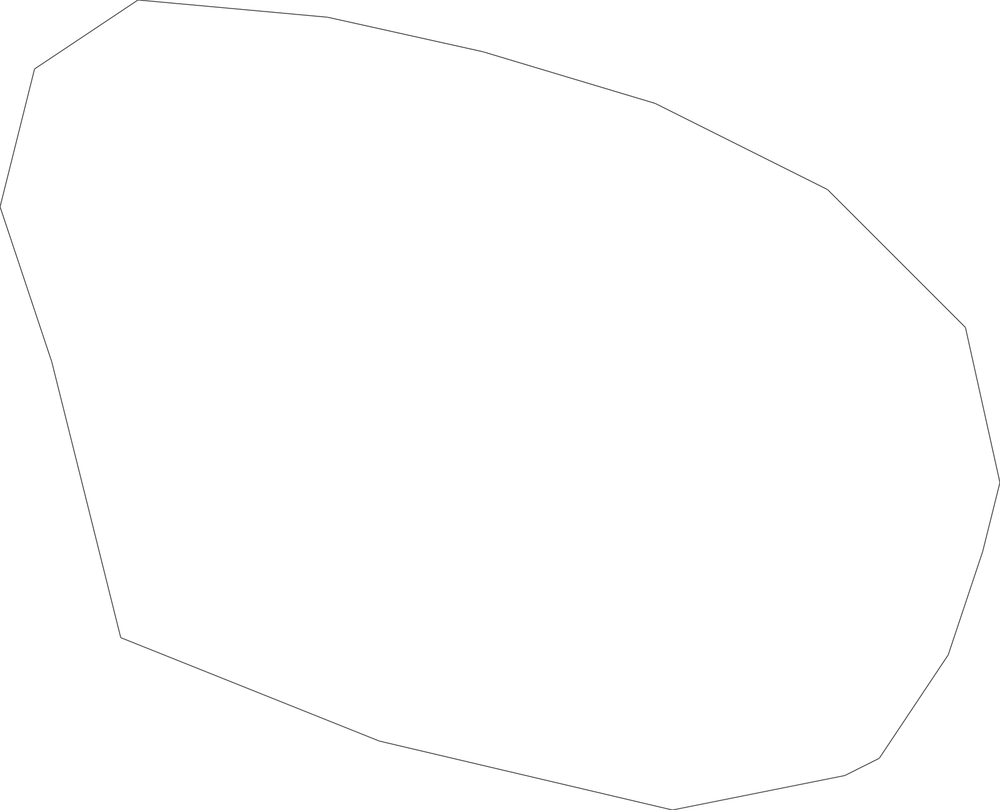
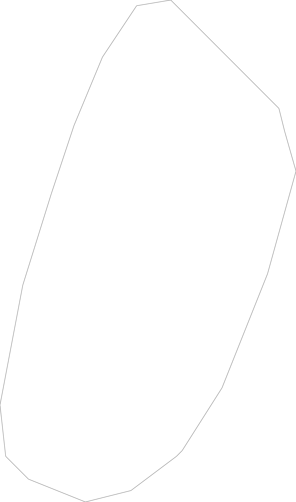

# Rapport du TP1

## How to run

Open a terminal in `build` folder and then run following command:
```
cmake .. && make && ./target ../RiceGrains/Rice_basmati_seg_bin.pgm ../RiceGrains/Rice_japonais_seg_bin.pgm ../RiceGrains/Rice_camargue_seg_bin.pgm
```

This will run the grain counting on every file.
The results of each execution is stored in the `build` 
folder with the following convention :  
`inital_file_name/digital_topology_used/result.csv`

The results can be viewed using any csv reader (Excel, Visual Studio Code, Atom, ...)

In case the program can't run, the file `target` in `build` is a 
version compiled on university computers. To run it open a terminal in `build` folder and run:
```
./target ../RiceGrains/Rice_basmati_seg_bin.pgm ../RiceGrains/Rice_japonais_seg_bin.pgm ../RiceGrains/Rice_camargue_seg_bin.pgm
```

If this still doesn't work, don't worry all processed files are included in `build` folder.

## Step 1

- Basmati Rice: long and thin
- Camargue Rice: medium and thick
- Japanese Rice: small and round

## Step 2

| Rice type | 4_8 adj | 8_4 adj |
|---|---|---|
| Basmati | 141 | 116 |
| Camargue | 132 | 111 |
| Japanese | 147 | 135 |

All images are ill-composed some of them contains grains half out of the frame, and some basmatis rice grain are split in the segmented image without really being segmented.

To eliminate grains whose not entirely in the frame, we add a white border. This will result in a big component that include all the unwanted rice grains.  
Then we simply search a component who have an x-coordinate at 0, and we remove it.

After that we've got :

| Rice type | 4_8 adj | 8_4 adj |
|---|---|---|
| Basmati | 124 | 100 |
| Camargue | 112 | 93 |
| Japanese | 137 | 125 |


## Step 3

Here you can see the boundary of the first grain found for each type :

|basmati|japanese|camargue|
|---|---|---|
||||

## Step 4

Here you can see the segmented boundary of the first grain found for each type :

|basmati|japanese|camargue|
|---|---|---|
||||


## Step 4 : Area

As said in the introduction, results can be found in result.csv file for each grain type.

These are the average and standard deviation (SD) of every value for the area only for 8_4 adjacency

| |basmati|camargue|japanese|
|---|---|---|---|
|average|2295.55|2684.45|2050.38|
|SD|355.70|500.78|137.40|

This shows that the area of 70% of:
- basmati rice grains are between 1940 and 2651.
- camargue rice grains are between 2184 and 3185.
- japanese rice grains are between 1913 and 2188.

The conclusion is that if the area is above 2186, it can be basmati or camargue rice.

This doesn't seem to be a good criterion.

## Step 5

Same thing here :

| |basmati|camargue|japanese|
|---|---|---|---|
|average|40419.51|130901.27|86369.92|
|SD|6780.10|5726.67|6255.26|

This shows that the perimeter of 70% of:
- basmati rice grains are between  33639  and  47200.
- camargue rice grains are between 125175 and 136628.
- japanese rice grains are between 80115  and  92625.

The perimeter can be used to classify grains because 
the perimeters are really appart from each other.

## Step 6

| |basmati|camargue|japanese|
|---|---|---|---|
|average|0.62|0.87|1.05|
|SD|0.17|0.20|0.15|

This shows that the circularity of 70% of:
- basmati rice grains are between  0.45  and  0.79.
- camargue rice grains are between 0.67  and  1.07.
- japanese rice grains are between 0.90  and  1.20.

The results aren't enough different to be used as criterion.  
If this is used as criterion anyway, the only thing that we 
can say is that if the circularity is big (above 1) it's 
probably japanese rice.

## Step 7

In the previous steps, the mean and standard deviation are 
used to determinate if mesures are useful in the classification.

If we use all measurements together we can achieve a correct
solution but far from perfect.  
To improve the results, we could also compute the 
maximum and minimum distance between the polygon's points.   
We should see that for basmati rice the maximum 
distance is greater than the others and the minimum distance
is smaller that the others.

